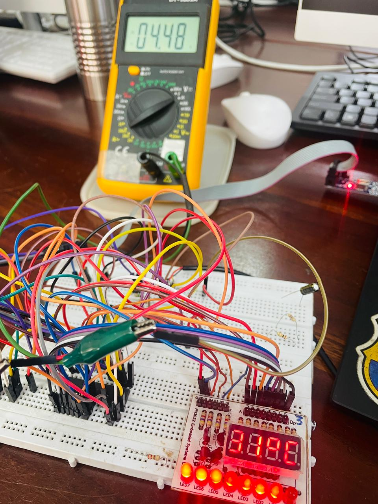
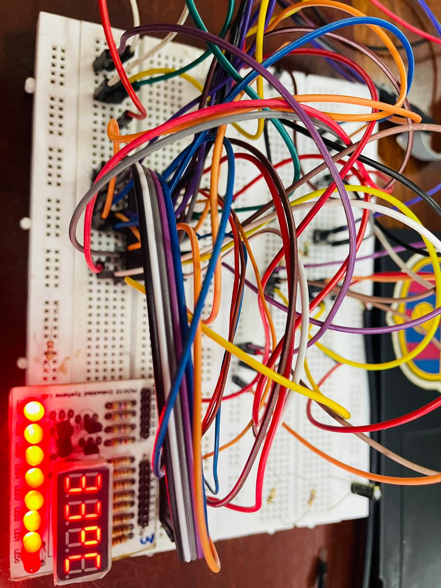

# 🌡️ ATmega328P Digital Thermometer (DS18B20 & Multiplexed SSD)


A bare-metal embedded C project for the **ATmega328P** microcontroller that reads high-precision temperature data from a **DS18B20 1-Wire Digital Sensor** and displays it on a custom **Multiplexed 4-Digit 7-Segment Display (SSD)**. 

Developed as part of the **EE3032 Embedded Systems Lab**, this project highlights the implementation of tightly timed digital communication protocols alongside hardware display multiplexing without causing screen flickering or system lag.

---

## 📸 Hardware Setup

Below is the physical hardware configuration for the system. 

*(Note: If you cloned this repository, ensure your uploaded images are named `board.jpg` and `sensor.jpg` in the root directory for them to render correctly).*

<div align="center">
  
  
</div>

> **Left:** The custom EE3032 lab board showing the active 4-digit multiplexed display stably rendering the room temperature.  
> **Right:** The waterproof DS18B20 sensor probe wired on the breadboard with a pull-up resistor.

---

## 🧠 Key Technical Features

* **Bare-Metal 1-Wire Timing:** Implements the custom microsecond-level signaling (`reset`, `read_bit`, `write_bit`, `read_byte`, `write_byte`) completely from scratch without external Arduino-like libraries.
* **Non-Blocking Active Delay Loop:** The DS18B20 requires up to **750 ms** to process a temperature conversion. A standard blocking delay would halt the MCU, turning off the multiplexed display and causing severe flickering. This firmware utilizes an interleaved active loop that continuously calls `ssdDisplay()` during the conversion window to maintain visual persistence of vision (POV).
* **Advanced Pin Mapping & Masking:** The lab board splits the 7-segment segment pins awkwardly across `PORTD` (Pins 0–5) and `PORTC` (Pins 4–5). The firmware safely maps the 8-bit character data across these separate registers using bitwise masks without disrupting neighboring pins.
* **Robust Fault Management:** If communication with the DS18B20 fails (e.g., sensor unplugged or missing pull-up resistor), the firmware catches the failed 1-Wire initialization handshake and dynamically flashes an `Err ` status on the screen.

---

## ⚙️ Hardware Pinout & Wiring

### 1. Microcontroller Core
* **MCU:** ATmega328P (DIP-28 Package)
* **Clock Source:** **1 MHz** Internal RC Oscillator (`F_CPU 1000000UL`)

### 2. DS18B20 Sensor Interface
| Sensor Wire | Connection | Notes |
| :--- | :--- | :--- |
| **🔴 Red** | **5V** | System Power |
| **⚫ Black** | **GND** | Shared Common Ground |
| **🟡 Yellow** | **`PB0` (Pin 14)** | **Critical:** Must be bridged to **5V** using a **4.7 kΩ** pull-up resistor. |

### 3. Multiplexed 4-Digit 7-Segment Display
* **Digit Transistor Enable Lines:** `PC0` (Digit 0) to `PC3` (Digit 3)
* **Segment Bus Lines (Bits 0–5):** `PD0` to `PD5`
* **Segment Bus Lines (Bits 6–7):** `PC4`, `PC5`

---

## 💻 Full Source Code (`main.c`)

```c
#define F_CPU 1000000UL 
#include <avr/io.h>
#include <util/delay.h>

// --- 1-WIRE CONFIGURATION ---
#define ONEWIRE_PIN  PB0
#define ONEWIRE_DDR  DDRB
#define ONEWIRE_PORT PORTB
#define ONEWIRE_IN   PINB

// --- MULTIPLEXED DISPLAY CONFIGURATION ---
#define DIG0 PC0
#define DIG1 PC1
#define DIG2 PC2
#define DIG3 PC3

uint8_t digits[4] = {10, 10, 10, 10}; 

/**
 * Custom 7-Segment Mapping Table (Common Cathode)
 * Indices: [0-9]=Numbers, [10]=Blank, [11]='°', [12]='C', [13]='E', [14]='r'
 */
const uint8_t ssd_digits[] = {
    0xFC, 0x60, 0xDA, 0xF2, 0x66, 0xB6, 0xBE, 0xE0, 0xFE, 0xF6, 
    0x00, 0xC6, 0x9C, 0x9E, 0x0A                                
};

// --- 1-WIRE PROTOCOL IMPLEMENTATION ---
uint8_t onewire_reset(void) {
    uint8_t presence = 0;
    ONEWIRE_DDR |= (1 << ONEWIRE_PIN);  
    ONEWIRE_PORT &= ~(1 << ONEWIRE_PIN);
    _delay_us(480);                      
    
    ONEWIRE_DDR &= ~(1 << ONEWIRE_PIN);  
    _delay_us(60); 
    
    if (!(ONEWIRE_IN & (1 << ONEWIRE_PIN))) presence = 1; 
    _delay_us(420);                      
    return presence;
}

void onewire_write_bit(uint8_t bit) {
    ONEWIRE_DDR |= (1 << ONEWIRE_PIN);  
    ONEWIRE_PORT &= ~(1 << ONEWIRE_PIN);
    asm volatile("nop"); asm volatile("nop");
    
    if (bit) ONEWIRE_DDR &= ~(1 << ONEWIRE_PIN); 
    _delay_us(55); 
    ONEWIRE_DDR &= ~(1 << ONEWIRE_PIN);  
    asm volatile("nop");
}

uint8_t onewire_read_bit(void) {
    uint8_t bit = 0;
    ONEWIRE_DDR |= (1 << ONEWIRE_PIN);  
    ONEWIRE_PORT &= ~(1 << ONEWIRE_PIN);
    asm volatile("nop"); 
    
    ONEWIRE_DDR &= ~(1 << ONEWIRE_PIN);  
    asm volatile("nop"); asm volatile("nop");
    
    if (ONEWIRE_IN & (1 << ONEWIRE_PIN)) bit = 1;
    _delay_us(50);                      
    return bit;
}

void onewire_write_byte(uint8_t data) {
    for (uint8_t i = 0; i < 8; i++) {
        onewire_write_bit(data & 0x01);
        data >>= 1;
    }
}

uint8_t onewire_read_byte(void) {
    uint8_t data = 0;
    for (uint8_t i = 0; i < 8; i++) {
        if (onewire_read_bit()) data |= (1 << i);
    }
    return data;
}

// --- HARDWARE DISPLAY DRIVER ENGINE ---
void setSegments(uint8_t seg_data) {
    PORTD = (PORTD & 0xC0) | (seg_data & 0x3F);

    if(seg_data & 0x40) PORTC |= (1 << PC4);
    else PORTC &= ~(1 << PC4);

    if(seg_data & 0x80) PORTC |= (1 << PC5);
    else PORTC &= ~(1 << PC5);
}

void ssdDisplay(void) {
    for(uint8_t i = 0; i < 4; i++) {
        PORTC &= ~((1<<DIG0) | (1<<DIG1) | (1<<DIG2) | (1<<DIG3));

        uint8_t seg_data = ssd_digits[digits[i]];
        setSegments(seg_data);

        if(i == 0) PORTC |= (1 << DIG0);
        if(i == 1) PORTC |= (1 << DIG1);
        if(i == 2) PORTC |= (1 << DIG2);
        if(i == 3) PORTC |= (1 << DIG3);

        _delay_ms(2); 
    }
    PORTC &= ~((1<<DIG0) | (1<<DIG1) | (1<<DIG2) | (1<<DIG3));
}

// --- MAIN SYSTEM LOOP ---
int main(void) {
    DDRC |= (1 << DIG0) | (1 << DIG1) | (1 << DIG2) | (1 << DIG3); 
    PORTC &= ~((1 << DIG0) | (1 << DIG1) | (1 << DIG2) | (1 << DIG3));
    
    DDRD |= 0x3F;                    
    DDRC |= (1 << PC4) | (1 << PC5); 
    
    int8_t temp = 0;
    uint8_t lsb, msb;
    int16_t raw_temp;
    
    while (1) {
        if (onewire_reset()) {
            onewire_write_byte(0xCC); 
            onewire_write_byte(0x44); 
            
            // Interleaved delay loop (~760ms total) to multiplex screen
            for (uint8_t i = 0; i < 95; i++) {
                ssdDisplay();
            }
            
            if (onewire_reset()) {
                onewire_write_byte(0xCC); 
                onewire_write_byte(0xBE); 
                
                lsb = onewire_read_byte();
                msb = onewire_read_byte();
                
                raw_temp = (msb << 8) | lsb;
                temp = (int8_t)(raw_temp / 16); 
                
                if (temp > 99) temp = 99;
                if (temp < 0)  temp = 0; 
                
                digits[0] = temp / 10;   
                if (digits[0] == 0) digits[0] = 10; // Zero blanking
                
                digits[1] = temp % 10;   
                digits[2] = 11;          // '°'
                digits[3] = 12;          // 'C'
            }
        } else {
            // Error State Configuration: Displays "Err "
            digits[0] = 13; // 'E'
            digits[1] = 14; // 'r'
            digits[2] = 14; // 'r'
            digits[3] = 10; // Blank
            ssdDisplay();
        }
    }
    return 0;
}
